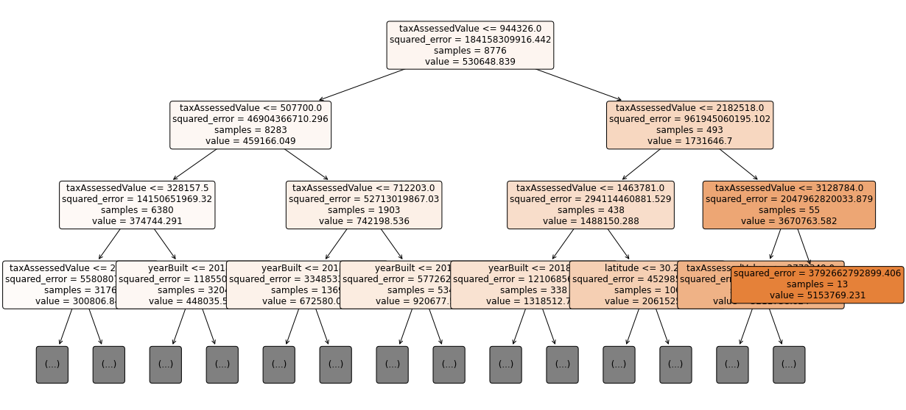
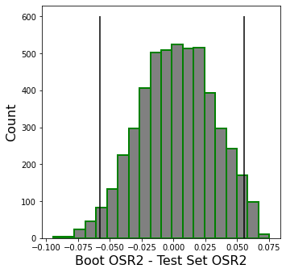

# Predicting Austin Housing Prices
### Richard Lee, Tiffany Lee, Won Shil Park, Samuel Tesfai

## Motivation

Purchasing real estate is one of the biggest transactions that a person makes in their lifetime. Once a person purchases property, the purchase is difficult to reverse and has to be made with thorough consideration and caution. However, it is unlikely for a first-time buyer to be knowledgeable enough when evaluating the value of a home. This can often lead to consumers having to blindly trust an agent that they recently met. Even then, there is no metric for the consumer to gauge whether their purchase is sound. If there exists a reliable model, this will create a level playing field and provide the consumers with an assurance that they are making the right purchase.

The real estate market is one of the few remaining sectors that has not been significantly enhanced by technology. With more real estate agents than homes for sale in the U.S. in January 2021, this exorbitant amount of middlemen is presented as a burden to consumers and real estate companies alike ([source](https://www.wsj.com/articles/new-realtors-pile-into-hot-housing-market-most-find-it-tough-going-11616328002)). A good model will be beneficial by simplifying the process and reducing costs to reach an equilibrium in the unreasonable current market structure. Our model will predict the value of a house and identify what factors best determine the price to help first-time home purchasers and real estate companies make better purchasing decisions.

## Data: Sources

For our research, we used the [Austin Housing Prices Kaggle dataset (Version 1)](https://www.kaggle.com/ericpierce/austinhousingprices/version/1). There were multiple versions of the dataset provided including the cleaned version. However, we used the raw unprocessed Version 1 (with 736 features) for this project. All the data cleaning and processing is our independent work. This dataset was sourced from Zillow and was processed through the ZTRAX program.

## Data: Cleaning

The original dataset had 16,482 observations and 736 columns. There were a lot of missing values in the dataset so we first dropped all the columns that had more than 20% null values. This left us with 138 columns. Of the remaining columns, we noticed that there were copies of the same columns and columns that just reported useless or obscure information. After removing these columns and doing feature selection, the number of columns dropped down to 34. We then removed any rows containing null values and this left us with a workable dataset with 12,538 observations and 34 columns (before any one-hot encoding). Another issue we fixed was standardizing the home’s area to one type of metric, square feet, through converting any values in acres to square feet.

## Data: Feature Selection

In order to inform our decisions in feature selection, we chose to use the latest_price as our target. After dropping our first set of columns which left us with 138 columns, we went through every remaining column and decided to remove it if we knew the information was not relevant to our models. One example of this were columns that described a categorical variable but had too many unique values. One-hot encoding of said columns would result in many new features being added which may cause overfitting. Another issue was columns that were categorical but had very few values for a particular category. One column reported whether or not each house had a quarter-sized bathroom while only 14 houses had this type of bathroom. Such columns wouldn’t provide enough information for houses that belong to the minority category and most likely would not add any predictive power to any of our models.  

## Analytics: Models

### Linear Regression (OLS):

Initially, we ran a Linear Regression (OLS) model with no modifications to the target and features list. We adjusted the model using variable inflation factors (VIF). The results before and after using VIF are:

*Before VIF:*                       *After VIF:*

       

When choosing which column to drop depending on the VIF, we had two variables with high VIFs that we needed to consider: `taxAssessedValue` (VIF = 19.233612) and `taxAnnualAmount` (VIF = 12.304308). Although `taxAssessedValue` has a higher VIF, the negative slope coefficient and t-value in the OLS model caused the OSR2 value to drop significantly to around -0.67. The OSR2 value got lower after removing the second-highest VIF which scored ~5 after the second VIF test, to an OSR2 value of -0.36. Thus, we found that instead of using the column with the negative coefficient, we would get rid of the column with the second-highest VIF which gives us an OSR2 value of 0.77 which is slightly higher than the model before we did our VIF test.

### CART (Decision Tree Regression): ###

The Decision Tree Regressor model was used with the parameters: `min_samples_split=10, ccp_alpha=0.02, random_state = 88`). The most important features were `taxAssessedValue` followed by `yearBuilt` and `livingArea`. Training the model to predict the log of `latest_price` instead of latest_price resulted in a poorer performance: 

We then trained a decision tree regression model with cross-validation with differing `ccp_alpha` values and observed that the $OSR^2$ value remains constant throughout all `ccp_alpha` values. The feature importance of the cross-validated model remained the same as the non-cross-validated model. The $R^2$ value of the cross-validated model was 0.83108 and the performance of the cross-validated model was:

The performance of CART models is typically worse than Random Forest but it has the advantage of providing better interpretability.

### Random Forest Regression:

Random Forest Regression is an ensemble technique that consists of using hundreds of CART decision trees on various sub-samples of the dataset and averaging to improve the predictive accuracy to control overfitting. Parameters used in Random Forest Regression include the following:

- `max_features`: controls the number of variables examined at each split of the fitted CART trees
- `min_samples_leaf`: controls the minimum number of observations in each CART tree terminal node
- `n_estimators`: controls the number of CART trees built
- `random_state`: controls both the randomness of the bootstrapping of the samples used when building trees

We initially considered using the following values for the parameters for the simple Random Forest model: `'max_features'=74,'min_samples_leaf'=5,'n_estimators'=500,'random_state'=42`.

We also attempted to do Grid Search Cross-Validation with the following parameters: `'max_features': np.linspace(4,74,8, dtype='int32'), 'min_samples_leaf': [5], 'n_estimators': [500], 'random_state': [42]`, with KFold crossvalidator:
`KFold(n_splits=5,random_state=333,shuffle=True)`

Additionally, there was an attempt at making a model that uses `log(latest_price)` as the target but it was not an improvement from the simple model and cross-validated model.

The models had the following performance results:

After running the models, we observed that the most important features for Random Forest Regression were `taxAssessedValue` followed by `taxAnnualAmount` and `livingArea`.

### Gradient Boosting Regression:

Gradient Boosting Regression is an ensemble method that successively fits regression trees on the residuals of the previous regression trees in the ensemble. First, we fitted the model on our training data to make a simple model.

Next, we performed Grid Search Cross-Validation and hyperparameter tuning. The parameters considered were:

- `learning_rate`: controls the contribution of each tree
- `n_estimators`: the number of trees in the ensemble

The parameters used were: `'learning_rate':np.linspace(.055,.3,5),'n_estimators':range(100,501,100)`

We then considered a model that was fitted on the 10 features of the original model with the highest Gini importance. We observed that predicting the log price instead of the price did not help improve the results of the model considerably.

Overall, the models had the following performance results:

After running the models, we observed that the most important features for Gradient Boosting Regression were `taxAssessedValue` followed by `yearBuilt` and `livingArea`.

## Analytics: Model Selection & Final Analysis

To evaluate the model performance, we used the following performance metrics: OSR2, RMSE, MAE. Below we have a table showing the performance metrics for each algorithm.

We determined that the model with the best performance is **Gradient Boosting Regressor with Grid Search Cross-Validation**. It has the highest $OSR^2$ value of 0.8467 and the RMSE and MAE values are similar to that of other models.

Next, we bootstrapped the selected model’s Bootstrap $OSR^2$ - Test Set $OSR^2$ with `resample_size = 5000` to validate the performance of our selected model. Here we have the table of performance metrics for the bootstrapped model, the histogram of the confidence interval of the Boot $OSR^2$ - Test Set $OSR^2$, and histograms of the $OSR^2$.

The OSR2 is validated within a 95% confidence interval of [-0.05768, 0.05559]. Since the confidence interval contains 0, there is no statistically significant difference between $OSR^2$ values of the two bootstrapped model $OSR^2$ and test set $OSR^2$. Therefore, the difference is not statistically significant, so it provides us with good confidence in our results.

## Impact & Conclusion

According to RocketMortgage, average buyers spend around 6 months to buy a home ([source](https://www.rocketmortgage.com/learn/how-long-does-it-take-to-buy-a-house)). In particular, first-time buyers already have a hard time consolidating all their options, with the additional responsibility to find a real estate agent that they trust. Once they do find a trustworthy agent, there is no guarantee that they will be getting their money’s value. They will also have to spend months on research before finally coming to a conclusion. To assist buyers with their research in housing investments, we provide a tool to estimate house prices in the Austin area: our Gradient Boosting Regressor model with Grid Search Cross-Validation.

To improve our model’s relevance and accuracy, we consider including more data sources and we would also contemplate other target values and features instead of using latest_price as the main basis for calculating how a property is valued. We also may consider trying other algorithms such as neural networks and model blending to see if we can get better performance than our existing model setup.